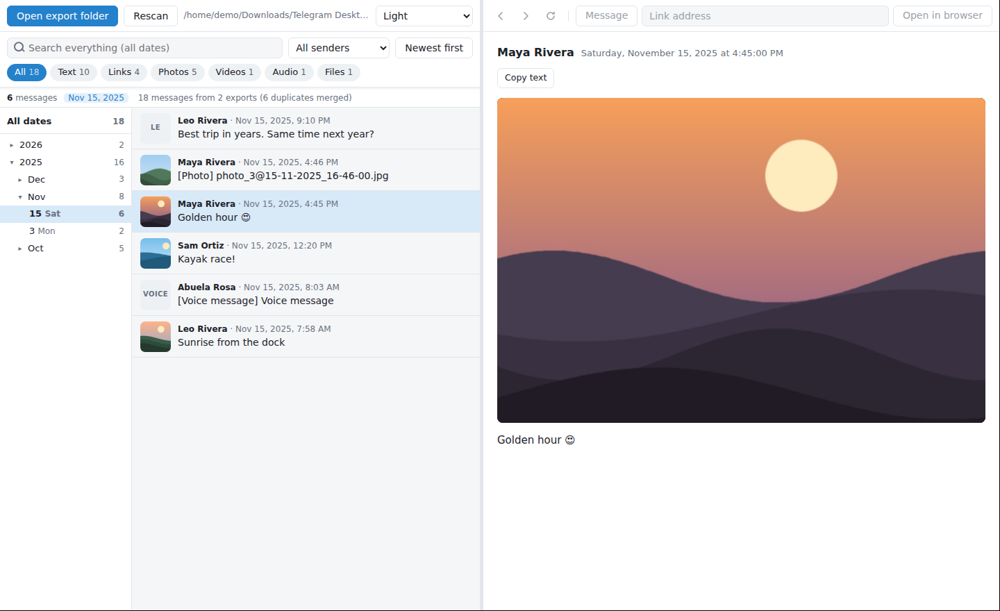
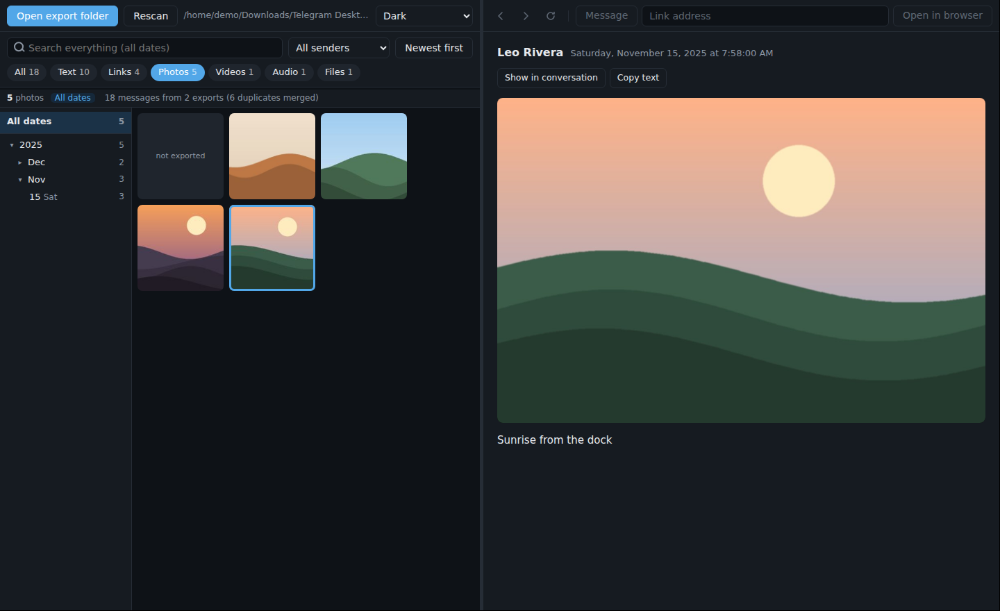

<p align="center">
  
</p>

<h1 align="center">Relook</h1>

<p align="center"><b>Go back through your Telegram chat exports.</b><br>
Browse by date, search everything, play the photos and videos, and open links in place.<br>
Windows · macOS · Linux</p>

<p align="center"></p>

Telegram Desktop can export a chat, but what you get is hundreds of HTML pages and tens of thousands of loose files. Relook turns that folder into something you can actually use.

- **Browse by date.** A year → month → day tree with message counts. Pick a day and everything narrows to it.
- **Two kinds of search.** The top box searches everything. Press <kbd>/</kbd> or <kbd>Ctrl</kbd>+<kbd>F</kbd> to search only the dates you've selected.
- **Filter by type.** Text, links, photos, videos, audio and files, plus a sender filter. Photos and videos show as a gallery.
- **View in place.** Photos, videos (with seeking), voice messages and PDFs open on the right. Arrow keys move through the list and the viewer follows.
- **Links open live, right there.** The right side is a real browser pane with back, forward and reload, and a **Message** button to return to where the link came from.
- **Several exports, one chat.** Exported the same chat more than once? Point Relook at the parent folder and the exports are merged, with duplicates removed.
- **Light, dark, or follow the system.**

<p align="center"></p>

## Download

Get the latest version from the [Releases page](../../releases).

| System | File | First launch |
|---|---|---|
| **Windows** 10/11 | `Relook-…-setup.exe` (installer) or `Relook-…-portable.exe` | Windows may show *"Windows protected your PC"*. Click **More info → Run anyway**. |
| **macOS** 12+ | `Relook-…-mac-arm64.dmg` (Apple silicon) or `…-mac-x64.dmg` (Intel) | macOS may say it *"cannot verify the developer"*. Open **System Settings → Privacy & Security** and click **Open Anyway**. |
| **Linux** | `Relook-…-x86_64.AppImage` or `Relook-…-amd64.deb` | AppImage: `chmod +x Relook-*.AppImage` and run it. Deb: `sudo apt install ./Relook-*.deb`. |

The warnings appear because the builds aren't signed with paid developer certificates. The app is built from this repository by GitHub Actions. You can check the [workflow](.github/workflows/release.yml) or build it yourself (below).

## Export a chat from Telegram

1. Open **Telegram Desktop** (the computer app, not the phone app).
2. Open the chat, click **⋮** (top right) → **Export chat history**.
3. Tick the media you want (photos, videos, voice messages, files), raise the size limit if you like, and keep **Format: HTML**.
4. Export. Telegram creates a `ChatExport_<date>` folder, usually inside `Downloads/Telegram Desktop`.

Then open Relook, click **Open export folder**, and choose either that `ChatExport_…` folder or the whole `Telegram Desktop` folder to merge every export in it. Relook remembers the folder for next time.

## Privacy

- Relook reads your export **from your own disk** and never uploads it anywhere. There's no account, no analytics and no server.
- Export files are served to the app's own pages under a private address that changes every launch, so websites you open in the browser pane can't read them.
- Opening a link is like opening it in any browser: that website is contacted and sees a normal visit. Web pages opened in Relook get no camera, microphone, location or notification access.
- Settings (last folder, theme, window size) are stored in your user profile's app-data folder.

## Build from source

Requires [Node.js](https://nodejs.org) 20 or newer.

```bash
git clone https://github.com/git-joelercoaster/Relook.git
cd Relook
npm install
npm start                      # run it
npm start -- "path/to/Telegram Desktop"   # open a folder directly
npm run dist                   # build installers for your OS into dist/
```

### Tests

The end-to-end tests launch the real app on a small, entirely fictional sample export ([`tests/fixtures`](tests/fixtures)), then check loading, merging, filters, media, links, security rules and themes.

```bash
npm test                  # Windows / macOS
xvfb-run -a npm test      # Linux without a desktop session
```

To regenerate the sample export: `python3 tests/fixtures/make_sample_export.py` (needs Pillow).

### How it's put together

| Path | What it is |
|---|---|
| `src/main.js` | Window, the three panes, the `relook://` file server (with byte ranges for video), folder scanning, settings, theme |
| `src/preload.js` | The small bridge between Relook's own pages and the app; web pages never get it |
| `web/index.html` | Left side: export parser, date tree, searches, list and gallery |
| `web/pane.html` | Right side: the message/media viewer |
| `web/shell.html` | The divider and the browser toolbar |

## Contributing

Issues and pull requests are welcome. Relook is a small personal project, provided as-is, so replies may take a while.

Ideas that would fit well: Telegram's JSON export format, WhatsApp/Signal exports, and a "find duplicates across exports" report.

## License

[MIT](LICENSE) © 2026 Leonidas Reyes

Relook is an independent project and is **not affiliated with, endorsed by, or sponsored by Telegram**. "Telegram" is a trademark of its respective owner and is used here only to describe the files Relook opens.
